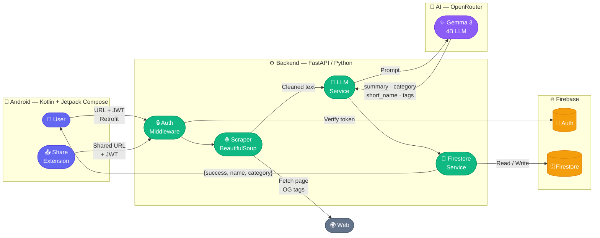
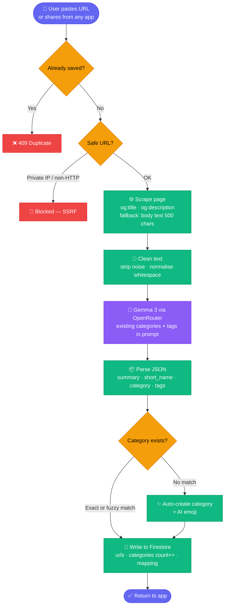

# Linkanaizer

> AI-powered Android bookmark manager — paste a link (or share from any app) and it automatically categorizes, summarizes, and tags it using an LLM pipeline.

No manual filing. Linkanaizer fetches the page, extracts its content, sends it through Gemma 3, and stores it under the right category with a one-sentence summary and keyword tags. Your saved links stay organized so you can actually find them later.

---

## Demo

| Home | Insert Link | Categories |
|------|-------------|------------|
|  |  |  |

> Screenshots coming soon — run locally with the setup steps below.

---

## System Architecture



---

## URL Processing Flow



---

## Features

- **AI categorization** — LLM reads the page and assigns it to one of your categories, or creates a new one automatically
- **Smart summaries** — every link gets a one-sentence description written by the model
- **Keyword tagging** — 1–2 tags per link for filtering within a category (reuses existing tags when possible)
- **Share extension** — share any URL from Chrome, WhatsApp, YouTube, etc. directly into Linkanaizer without opening the app
- **Emoji categories** — AI-suggested emoji per category with a local keyword fallback map
- **File import** — paste a WhatsApp chat export and every shared link is extracted, timestamped, and processed in bulk
- **Full link management** — move, delete, edit name/summary/tags, mark as read, mark as favourite
- **Category visibility** — hide categories from the home grid without deleting them
- **Duplicate detection** — the same URL cannot be saved twice per user
- **Real-time search** — filter links or categories by keyword
- **Google Sign-In** — one-tap login alongside email/password
- **SSRF protection** — private IPs and non-HTTP schemes are blocked before any fetch

---

## Tech Stack

| Layer | Technology |
|-------|-----------|
| Android | Kotlin · Jetpack Compose · Navigation Compose |
| Architecture | MVVM · Hilt (Dagger) · StateFlow |
| Networking | Retrofit 2 · OkHttp · `AuthInterceptor` (auto-attaches Firebase JWT) |
| Auth | Firebase Authentication (email/password + Google Sign-In) |
| Backend | Python 3 · FastAPI · Uvicorn |
| Database | Cloud Firestore |
| AI | OpenRouter API → Google Gemma 3 4B (`google/gemma-3-4b-it`) |
| Web scraping | `requests` + BeautifulSoup4 (SSRF-safe) |

---

## Project Structure

```
linkanaizer/
├── Android/                              # Native Android app (Kotlin + Compose)
│   └── app/src/main/java/com/linkanaizer/app/
│       ├── ui/
│       │   ├── auth/                     # Login screen + AuthViewModel
│       │   ├── home/                     # Home screen + HomeViewModel
│       │   ├── insert/                   # Insert link screen + ViewModel
│       │   ├── category/                 # Single category screen + ViewModel
│       │   ├── categories/               # Category manager screen + ViewModel
│       │   ├── links/                    # All links screen
│       │   ├── importfile/               # Bulk import screen + ViewModel
│       │   ├── share/                    # Share extension (ShareReceiverActivity)
│       │   ├── settings/                 # Settings screen
│       │   ├── navigation/               # NavGraph + Screen sealed class
│       │   └── components/               # Reusable Compose components
│       ├── data/
│       │   ├── api/
│       │   │   ├── LinkanazerApi.kt      # Retrofit interface (all endpoints)
│       │   │   └── AuthInterceptor.kt    # OkHttp interceptor — attaches JWT
│       │   ├── repository/               # LinkRepository, CategoryRepository, AuthRepository
│       │   └── dto/                      # Request/response data classes
│       ├── di/AppModule.kt               # Hilt module (Retrofit, OkHttp, Firebase)
│       └── util/
│           ├── Resource.kt               # Sealed Result wrapper (Success / Error)
│           └── Constants.kt              # BASE_URL
│
└── Backend/                              # FastAPI server (Python)
    └── app/
        ├── main.py                       # App factory + CORS
        ├── routers/                      # links · categories · files · users
        ├── services/
        │   ├── url_service.py            # Core URL pipeline + link CRUD
        │   ├── extract_service.py        # HTML scraper (SSRF-safe)
        │   ├── model_api.py              # OpenRouter / Gemma 3 + retry logic
        │   └── category_service.py
        ├── core/firebase_config.py       # Firebase Admin SDK init
        └── utils/token_verifier.py       # JWT middleware
```

---

## API Endpoints

| Method | Path | Description |
|--------|------|-------------|
| `POST` | `/register` | Create user record in Firestore |
| `POST` | `/google_auth` | Register / sign-in via Google credential |
| `POST` | `/process_url` | Scrape → summarize → categorize → save a URL |
| `POST` | `/get_links` | Fetch links (all or filtered by category) |
| `POST` | `/delete_link` | Delete a link and decrement category count |
| `POST` | `/move_link` | Move a link to a different category |
| `POST` | `/update_link` | Edit name, summary, tags, or category |
| `POST` | `/toggle_favorite` | Toggle is_favorite flag |
| `POST` | `/mark_read` | Mark a link as read |
| `GET` | `/get_categories` | List all categories with count + emoji |
| `POST` | `/insert_category` | Create a new category (AI emoji) |
| `POST` | `/delete_category` | Delete a category |
| `POST` | `/change_visibility` | Show / hide a category on the home grid |
| `POST` | `/import_text` | Bulk import URLs from pasted text |
| `POST` | `/import_progress` | Poll bulk import progress |
| `POST` | `/cancel_import` | Cancel an in-progress bulk import |
| `POST` | `/fix_emojis` | Re-generate emojis for all categories |
| `GET` | `/ping` | Health check |

All routes (except `/ping`) require `Authorization: Bearer <Firebase ID token>`.

---

## Setup

### Prerequisites

- Android Studio (Hedgehog or later)
- Python ≥ 3.10
- A Firebase project (Firestore + Authentication enabled, Google Sign-In enabled)
- An OpenRouter API key

### Backend

```bash
cd Backend
python -m venv env
source env/bin/activate   # Windows: env\Scripts\activate
pip install -r requirements.txt
```

Create `Backend/.env`:

```env
OPENROUTER_API_KEY=your_openrouter_key
```

Place your Firebase service account JSON at `Backend/app/core/serviceAccountKey.json`.

```bash
uvicorn app.main:app --reload --port 8000
```

### Android

1. Open the `Android/` folder in Android Studio
2. Add your `google-services.json` (from Firebase Console) to `Android/app/`
3. Set `BASE_URL` in `Android/app/src/main/java/com/linkanaizer/app/util/Constants.kt` to your backend URL
4. Run on a device or emulator

---

## Environment Variables

| Variable | Location | Description |
|----------|----------|-------------|
| `OPENROUTER_API_KEY` | `Backend/.env` | Key for OpenRouter (Gemma 3) |
| `google-services.json` | `Android/app/` | Firebase Android config |
| `serviceAccountKey.json` | `Backend/app/core/` | Firebase Admin SDK credentials |

---

## License

MIT
